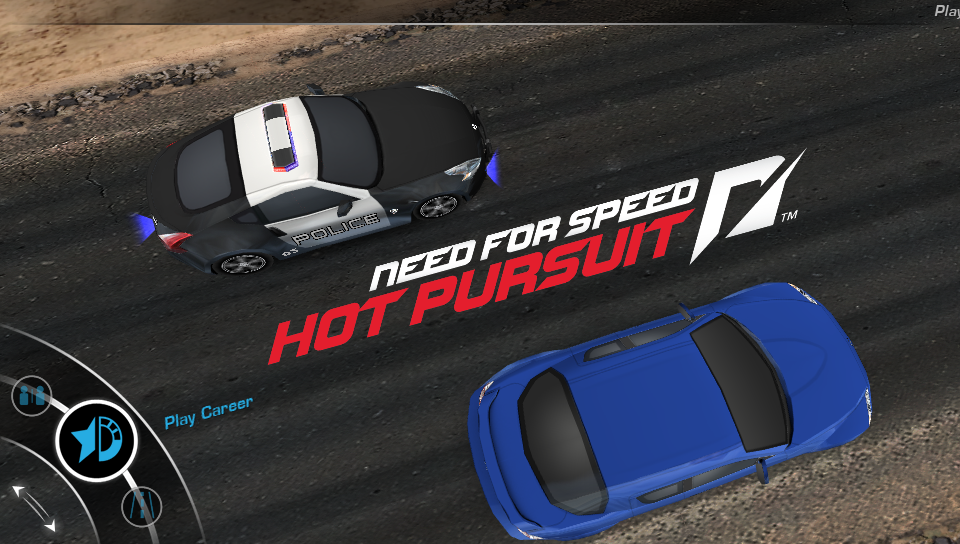
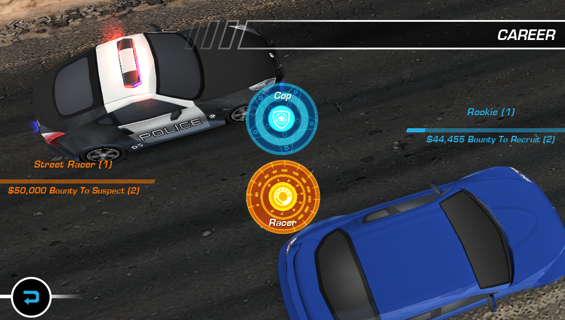
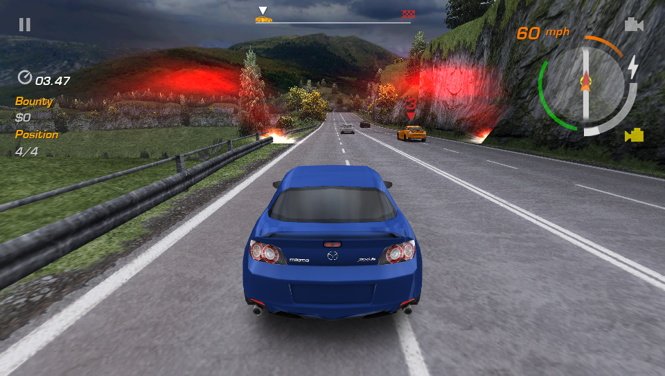
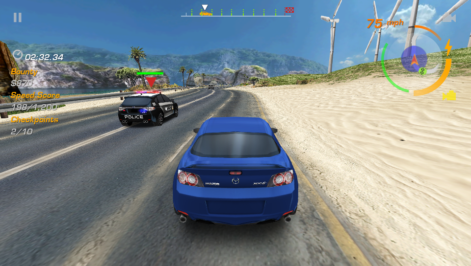
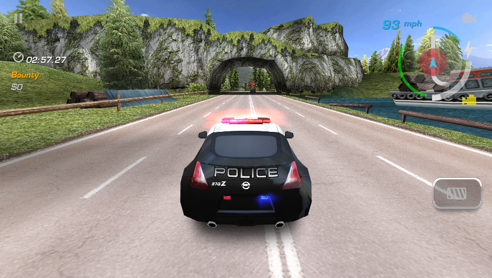

# Need for Speed: Hot Pursuit Vita

<p align="center"></p>

This is a wrapper/port of *Need for Speed: Hot Pursuit Android* for the *PS Vita*.

The port works by loading the official Android ARMv6 executable in memory, resolving its imports with native functions and patching it in order to properly run.

## Setup Instructions (For End Users)

In order to properly install the game, you'll have to follow these steps precisely:

- Install [kubridge](https://github.com/TheOfficialFloW/kubridge/releases/) and [FdFix](https://github.com/TheOfficialFloW/FdFix/releases/) by copying `kubridge.skprx` and `fd_fix.skprx` to your taiHEN plugins folder (usually `ur0:tai`) and adding two entries to your `config.txt` under `*KERNEL`:

```
  *KERNEL
  ux0:tai/kubridge.skprx
  ux0:tai/fd_fix.skprx
```

**NOTE:** Don't install fd_fix.skprx if you're using repatch plugin

- **Optional**: Install [PSVshell](https://github.com/Electry/PSVshell/releases) to overclock your device to 500Mhz.
- Obtain your copy of *Need for Speed: Hot Pursuit* version *2.0.28* legally from the Google Play store in form of an `.apk` file and an `.obb` file (usually located inside the `/sdcard/android/obb/com.eamobile.nfshp_row_wf/` folder). [You can get all the required files directly from your phone](https://stackoverflow.com/questions/11012976/how-do-i-get-the-apk-of-an-installed-app-without-root-access) or by using an apk extractor you can find in the play store. The apk can be extracted with whatever Zip extractor you prefer (eg: WinZip, WinRar, etc...) since apk is basically a zip file. You can rename `.apk` to `.zip` to open them with your default zip extractor.
 **Unfortunately the game was taken down from the Google Play store and is not available for download unless you have bought it previously.**

- Copy the `main.2022.com.eamobile.nfshp_row_wf.obb` file to `ux0:data/nfshp/`
- Open the apk and extract `libnfshp.so` from the `lib/armeabi` folder to `ux0:data/nfshp/`.
- Install [NFSHP.vpk](https://github.com/Electry/nfshp_vita/releases/latest) on your *PS Vita*.

## Notice

- Intro movie playback and local wifi multiplayer features are not yet implemented in this Vita port.
- Because the game requires touchscreen for menu navigation, you may not be able to play this port on PSTV. Furthermore, the original Android game only supports
accelerometer for steering and touch for other actions. The in-game input controls were reimplemented on the Vita, allowing you to use the analog joystick and hardware buttons, which are mapped accordingly:
  - Left Joystick - Steering
  - Left Trigger - Braking
  - Right Trigger - Acceleration (Auto-Acceleration is enabled by default, and can be disabled in the game's options)
  - Cross - Nitro
  - Circle - Handbrake
  - D-PAD Up - Trigger Roadblock / Overdrive
  - D-PAD Left - Trigger Spikestrip / Oil slick
  - D-PAD Right - Trigger EMP / Jammer

## Screenshots

<p align="center"></p>
<p align="center"></p>
<p align="center"></p>
<p align="center"></p>

## Build Instructions (For Developers)

In order to build the loader, you'll need a [vitasdk](https://github.com/vitasdk) build fully compiled with softfp usage.
Additionally, you'll need these libraries to be compiled as well with `-mfloat-abi=softfp` added to their CFLAGS:

- [kubridge](https://github.com/TheOfficialFloW/kubridge)

  - ```bash
    mkdir build && cd build
    cmake .. && make install
    ```

Afterwards, download the latest release of [PVR_PSP2](https://github.com/GrapheneCt/PVR_PSP2/) and copy `libgpu_es4_ext.suprx`, `libIMGEGL.suprx`, `libGLESv1_CM.suprx` and `libpvrPSP2_WSEGL.suprx` into the `prx/` folder

After all these requirements are met, you can compile the loader with the following commands:

```
mkdir build && cd build
cmake .. && make
```

## Credits

- [TheFloW](https://github.com/TheOfficialFloW/), [Rinnegatamante](https://github.com/Rinnegatamante/) for previous Android Vita ports
- [GrapheneCt](https://github.com/GrapheneCt/) for PVR_PSP2
